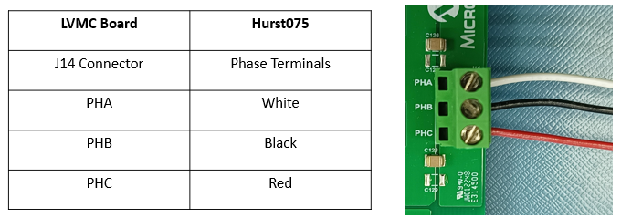
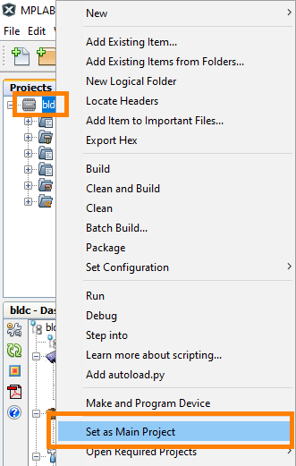
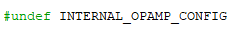

 

# Hall Sensored Six-Step Commutation for BLDC Motor : dsPIC33CK Low Voltage Motor Control (LVMC) Board 

## 1. INTRODUCTION

This document describes the setup requirements for driving the Brushless DC (BLDC) Motor using six-step commutation with Hall Sensor feedback on the hardware platform dsPIC33CK Low Voltage Motor Control (LVMC) Board.

For details about six-step commutation of BLDC motor using Hall Sensor feedback, refer to Microchip application note [AN957](https://ww1.microchip.com/downloads/aemDocuments/documents/OTH/ApplicationNotes/ApplicationNotes/BLDCMC00957a.pdf)  “Sensored BLDC Motor Control”.

## 2. SUGGESTED DEMONSTRATION REQUIREMENTS

### 2.1 Motor Control Application Firmware Required for the Demonstration
To clone or download this application firmware on GitHub, 
- Navigate to the [main page of this repository](https://github.com/microchip-pic-avr-solutions/lvmc-dspic33ck256mp508-an957) and 
- On the tab **<> Code**, above the list of files in the right-hand corner, click Code, then from the menu, click **Download ZIP** or copy the repository URL to **clone.**
> **Note:**  
>In this document, hereinafter this firmware package is referred as **firmware.**

### 2.2 Software Tools Used for Testing the firmware

- MPLAB® X IDE **v6.10** 
- DFP: **dsPIC33CK-MP_DFP v1.11.346**
- MPLAB® XC16 Compiler **v2.10**
- MPLAB® X IDE Plugin: **X2C-Scope v1.3.3** 
> **Note:**  
>The software used for testing the firmware prior to release is listed above. It is recommended to use the version listed above or later versions for building the firmware.
### 2.3 Hardware Tools Required for the Demonstration
- dsPIC33CK Low Voltage Motor Control Board, Part-No. [DM330031](https://www.microchip.com/developmenttools/ProductDetails/PartNO/DM330031)
- 24V Power Supply, Part-No. [AC002013](https://www.microchipdirect.com/dev-tools/AC002013)
- 24V 3-Phase Brushless DC Motor, Part-No. [AC300020](https://www.microchip.com/en-us/development-tool/AC300020)   
> **Note:**  
> All items listed under the section Hardware Tools Required for the Demonstration are available at [microchip DIRECT](https://www.microchipdirect.com/)

## 3. HARDWARE SETUP
This section describes hardware setup required for the demonstration.

1. Motor currents are amplified on the Motor Control Development Board; it can also be amplified by the amplifiers internal to the device dsPIC33CK256MP508. The firmware and development board are configured to sample and convert internal amplifier outputs (**'internal op-amp configuration'**). The Table below summarizes the resistors to be populated and removed to convert the development board from **‘internal op-amp configuration’** to **‘external op-amp configuration’** or vice versa.

     

     

2. Connect the  3-phase wires from the motor to the **connector J14**,  provided on the Motor Control Development Board in the specified order as shown below.
     

     

3. Connect the  Hall Sensor wires from the motor to the **connector J7**,  provided on the Motor Control Development Board in the specified order as shown below.
     

     

4. Plug the 24V power supply to **connector J1** on the Motor Control Development Board. Alternatively, the development board can also be powered through connector J2.

     

     

 
5. The board has an onboard programmer **PICkit™ On Board (PKoBv4)** , which can be used for programming or debugging the microcontroller or dsPIC DSC on the development board. To use the onboard programmer, connect a micro-USB cable between the Host PC and **connector J13** on the Motor Control Development Board.

     

     

6. Alternatively, connect the Microchip programmer/debugger MPLAB® PICkit™ 4 In-Circuit Debugger between the Host PC used for programming the device and the **ICSP header J10** on the Motor Control Development Board (as shown). Ensure that PICkit 4 is oriented correctly before proceeding.

     

     

 
  

## 4. SOFTWARE SETUP AND RUN
### 4.1 Setup: MPLAB X IDE and MPLAB XC16 Compiler
Install **MPLAB X IDE** and **MPLAB XC16 Compiler** versions that support the device **dsPIC33CK256MP508** and **PKoBv4.** The MPLAB X IDE, MPLAB XC16 Compiler, and X2C-Scope plug-in used for testing the firmware are mentioned in the [Motor Control Application Firmware Required for the Demonstration](#21-motor-control-application-firmware-required-for-the-demonstration) section. 

To get help on  

- MPLAB X IDE installation, refer [link](https://microchipdeveloper.com/mplabx:installation)
- MPLAB XC16 Compiler installation steps, refer [link](https://microchipdeveloper.com/xc16:installation)

If MPLAB IDE v8 or earlier is already installed on your computer, then run the MPLAB driver switcher (Installed when MPLAB®X IDE is installed) to switch from MPLAB IDE v8 drivers to MPLAB X IDE drivers. If you have Windows 8 or 10, you must run the MPLAB driver switcher in **Administrator Mode**. To run the Device Driver Switcher GUI application as administrator, right-click on the executable (or desktop icon) and select **Run as Administrator**. For more details, refer to the MPLAB X IDE help topic **“Before You Begin: Install the USB Device Drivers (For Hardware Tools): USB Driver Installation for Windows Operating Systems.”**

### 4.2 Setup: X2C-SCOPE
X2C-Scope is an MPLAB X IDE plugin that allows developers to interact with an application while it runs. X2C-Scope enables you to read, write, and plot global variables (for motor control) in real-time. It communicates with the target using the UART. To use X2C-Scope, the plugin must be installed. To set up and use X2C-Scope, refer to the instructions provided on the [web page](https://x2cscope.github.io/docs/MPLABX_Plugin.html).

## 5.  BASIC DEMONSTRATION
### 5.1 Firmware Description
The firmware version needed for the demonstration is mentioned in the section [Motor Control Application Firmware Required for the Demonstration](#21-motor-control-application-firmware-required-for-the-demonstration) section. This firmware is implemented to work on Microchip’s 16-bit Digital signal controller (dsPIC® DSC) **dsPIC33CK256MP508**. For more information, see the **dsPIC33CK256MP508 Family datasheet [(DS70005349)](https://ww1.microchip.com/downloads/en/DeviceDoc/dsPIC33CK256MP508-Family-Data-Sheet-DS70005349H.pdf)**.

The Motor Control Demo application uses push buttons to start or stop the motor and for direction reversal. Also, a potentiometer is used to vary the speed of the motor. This Motor Control Demo Application configures and uses peripherals like PWM, ADC, UART, etc. For more details, refer to Microchip Application note **[AN957](https://ww1.microchip.com/downloads/aemDocuments/documents/OTH/ApplicationNotes/ApplicationNotes/BLDCMC00957a.pdf), “Sensored BLDC Motor Control Using dsPIC30F2010”** available on the [Microchip website](https://www.microchip.com/en-us/application-notes).

> **Note:** 
> The project may not build correctly in Windows OS if the Maximum path length of any source file in the project is more than 260 characters. In case the absolute path exceeds or nears the maximum length, do any (or both) of the following:
> - Shorten the directory name containing the firmware used in this demonstration. If you renamed the directory, consider the new name while reading the instructions provided in the upcoming sections of the document.
> - Place firmware in a location such that the total path length of each file included in the projects does not exceed the Maximum Path length specified.  
> Refer to MPLAB X IDE help topic **“Path, File, and Folder Name Restrictions”** for details. 

### 5.2 Basic Demonstration

Follow the below instructions, step by step, to set up and run the motor control demo application:

1. Start **MPLAB X IDE** and open the project **bldc.X (File > Open Project)** with device selection **dsPIC33CK256MP508.**  
    

       

  

2. Set the project **bldc.X** as the main project by right-clicking on the project name and selecting **Set as Main Project** as shown. The project **bldc.X** will then appear in **bold.**
    

     

 

	
3. Open <code>**bldc_main.h** </code> (**bldc.X > Header Files**) in the project **bldc.X.**  
     - Ensure that the macro <code>**SPEED_PI_CLOSEDLOOP**</code> is defined in the header file<code> **bldc_main.h**</code>

          > **Note:**  
          > There are three different operating modes in this application - openloop duty control, closed loop speed control and closed loop torque control. 
          > These modes can be selected in the application code using the macros <code>**OPENLOOP**</code>, <code>**SPEED_PI_CLOSEDLOOP**</code> and <code>**CURRENT_PI_CLOSEDLOOP**</code>.
          Ensure that only one of the operating modes is defined at a time.

          

     - When internal amplifiers are used for current amplification (referred to as **internal op-amp configuration**), **define** the macro <code>**INTERNAL_OPAMP_CONFIG**</code> in <code>**port_config.h.**</code>
          
 

     - Otherwise, if external amplifiers are used for current amplification (referred to as **external op-amp configuration**), undefine the macro <code>**INTERNAL_OPAMP_CONFIG**</code> in the header file <code>**port_config.h.**</code>
        

 

4. Right-click on the project **bldc.X** and select **Properties** to open its **Project Properties** Dialog. Click the **Conf:[default]** category to reveal the general project configuration information. The development tools used for testing the firmware are listed in section [2.2 Software Tools Used for Testing the firmware.](#22-software-tools-used-for-testing-the-firmware)

     In the **Conf:[default]** category window: 
     - Ensure the selected **Device** is **dsPIC33CK256MP508.**
     - Select the **Connected Hardware Tool** to be used for programming and debugging. 
     - Select the specific Device Family Pack (DFP) from the available list of **Packs.** In this case, **dsPIC33CK-MP_DFP 1.11.346** is selected. 
     - Select the specific **Compiler Toolchain** from the available list of **XC16** compilers. 
     In this case, **XC16(v2.10)** is selected.
     - After selecting Hardware Tool and Compiler Toolchain, Device Pack, click the button **Apply**

     Please ensure that the selected MPLAB® XC16 Compiler and Device Pack support the device configured in the firmware

     

     

5. Ensure that the checkbox **Load symbols when programming or building for production (slows process)** is checked under the **Loading** category of the **Project Properties** window.       
        
     

     

6. To build the project (in this case, **bldc.X**) and program the device dsPIC33CK256MP508, click **Make and Program Device Main project** on the toolbar
    

    

  
7. If the device is successfully programmed, **LD10 (LED1)** will be turned **ON**, indicating that the dsPIC® DSC is enabled.
    

    

8. Run or stop the motor by pressing the push button **SW1.** The motor should start spinning smoothly in one direction in the nominal speed range. Ensure that the motor is spinning smoothly without any vibration. The LED **LD11(LED2)** is turned **ON** to show the button is pressed to start the motor.
     

     

 

9. The motor speed can be varied using the potentiometer **(POT1).**
    

    

 
10. Press the push button **SW2** to reverse the direction. 
     

     
 

11. Press the push button **SW1** to stop the motor.

>**Note:** 
>The macros <code>MAX_MOTORSPEED</code>, <code>MAX_MOTORCURRENT</code>, <code>POLEPAIRS</code>, <code>SECTOR</code> and <code>MAX_BOARDCURRENT</code>are specified in the header file <code>**bldc_main.h**</code> included in the project **bldc.X.** The macros <code> MAX_MOTORSPEED</code> and <code>MAX_MOTORCURRENT</code> are defined as per the Motor manufacturer’s specifications. Exceeding manufacture specifications may damage the motor or the board or both.

## 5.3  Data visualization through X2C-Scope Plug-in of MPLAB X

X2C-Scope is a third-party plug-in in MPLAB X, which helps in real-time diagnostics. The application firmware comes with the initialization needed to interface the controller with the host PC to enable data visualization through the X2C-Scope plug-in. Ensure the X2C-Scope plug-in is installed. For more information on how to set up a plug-in, refer to either the [Microchip Developer Help page](https://microchipdeveloper.com/mplabx:tools-plugins-available) or the [web page.](https://x2cscope.github.io/docs/MPLABX_Plugin.html)
 
1. To establish serial communication with the host PC, connect a micro-USB cable between the host PC and **connector J13** on the Motor Control Development Board. This interface is also used for programming. Alternatively, **connector J6** can be also used for serial communication.
      

       

2. Ensure the application is configured and running as described under section [5.2 Basic Demonstration](#52-basic-demonstration) by following steps 1 through 11.

3. Open the **X2C-Scope** window by selecting **Tools>Embedded>X2CScope.**
      

       

 

4. **In the X2C-Scope Configuration** window, open the **Connection Setup** tab and click **Select Project.** This opens the drop-down menu **Select Project** with a list of opened projects. Select the specific project **bldc** from the list of projects and click **OK.**
    

    

5. To configure and establish the serial communication for **X2C-Scope**, open the **X2CScope Configuration** window, click on the **Connection Setup** tab and:
     - Set **Baudrate** as **115200**, which is configured in the application firmware. 
     - Click on the **Refresh** button to refresh and update the list of the available Serial COM ports connected to the Host PC. 
     - Select the specific **Serial port** detected when interfaced with the Motor Control Development Board. The **Serial port** depends on the system settings

    

     

 

6. Once the **Serial port** is detected, click on **Disconnected** and turn to **Connected**, to establish serial communication between the Host PC and the board.
     

    

7. Open the **Project Setup** tab in the **X2CScope Configuration** window and,
     - Set **Scope Sampletime** as the interval at which <code>X2CScopeUpdate()</code> is called. In this application, it is every <code>50µs.</code> 
     - Then, click **Set Values** to save the configuration.

      

      

8.	Click on **Open Scope View** (in the **Data Views** tab of the **X2CScope Configuration** Window); this opens **Scope Window.**
     

      

    	     
9. In the **Scope Window**, select the variables that must be watched. To do this, click on the **Source** against each channel, and a window **Select Variables** opens on the screen. From the available list, the required variable can be chosen. Ensure checkboxes **Enable** and **Visible** are checked for the variables to be plotted.
To view data plots continuously, uncheck **Single-shot.** When **Single-shot** is checked, it captures the data once and stops. The **Sample time factor** value multiplied by **Sample time** decides the time difference between any two consecutive data points on the plot.
    

    

10.	Click on **SAMPLE**, then the X2C-Scope window plots variables in real-time, which updates automatically.
     

     

 

11.	Click on **ABORT** to stop.
     

     

 
  
## REFERENCES:
For additional information, refer following documents or links.

1. AN957 Application Note ["Sensored BLDC Motor Control Using dsPIC30F2010"](https://ww1.microchip.com/downloads/aemDocuments/documents/OTH/ApplicationNotes/ApplicationNotes/BLDCMC00957a.pdf)
2. dsPIC33CK Low Voltage Motor Control Board User’s Guide [(DS50002927)](https://ww1.microchip.com/downloads/aemDocuments/documents/MCU16/ProductDocuments/UserGuides/DS50002927a.pdf)
3. dsPIC33CK256MP508 Family datasheet [(DS70005349)](https://ww1.microchip.com/downloads/en/DeviceDoc/dsPIC33CK256MP508-Family-Data-Sheet-DS70005349H.pdf)
4. [Family Reference Manuals (FRM) of dsPIC33CK256MP508 family](https://www.microchip.com/en-us/product/dsPIC33CK256MP508#document-table)
5. MPLAB® X IDE User’s Guide [(DS50002027)](https://ww1.microchip.com/downloads/en/devicedoc/50002027d.pdf) or MPLAB® X IDE help
6. [MPLAB® X IDE installation](http://microchipdeveloper.com/mplabx:installation)
7. [MPLAB® XC16 Compiler installation](http://microchipdeveloper.com/xc16:installation)
8. [Installation and setup of X2Cscope plugin for MPLAB X](https://x2cscope.github.io/docs/MPLABX_Plugin.html)

